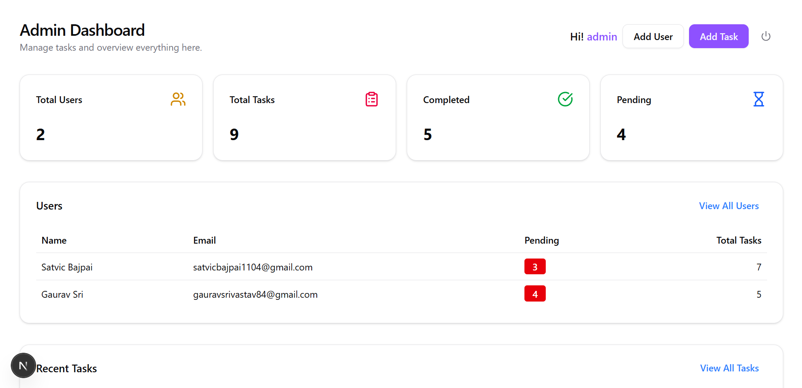
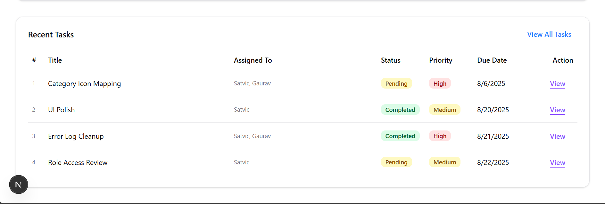
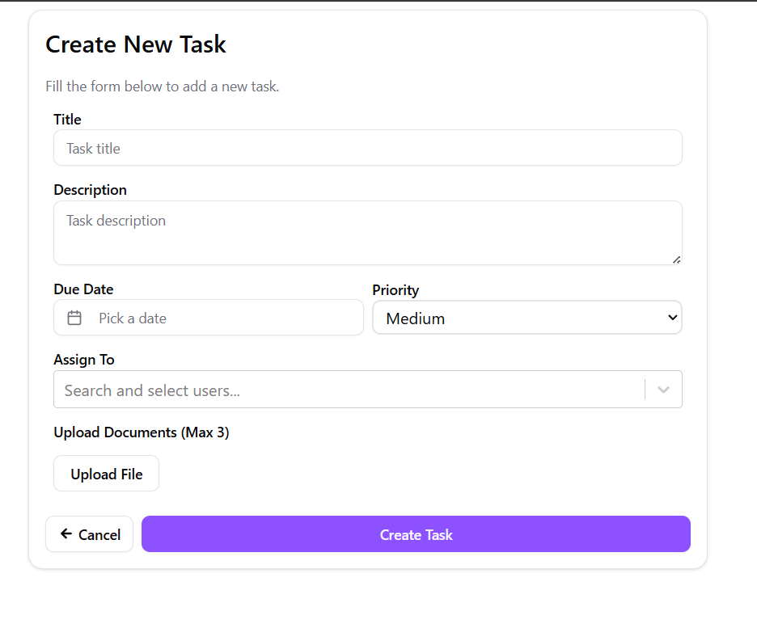
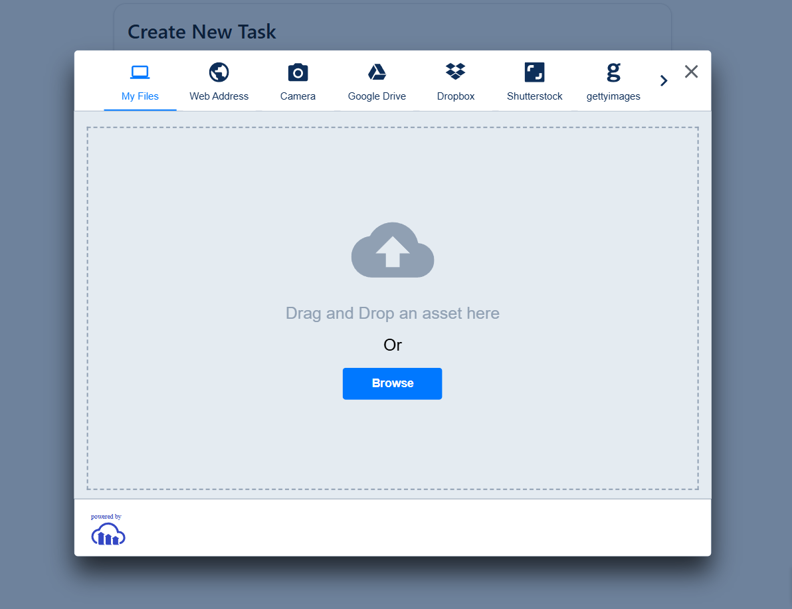
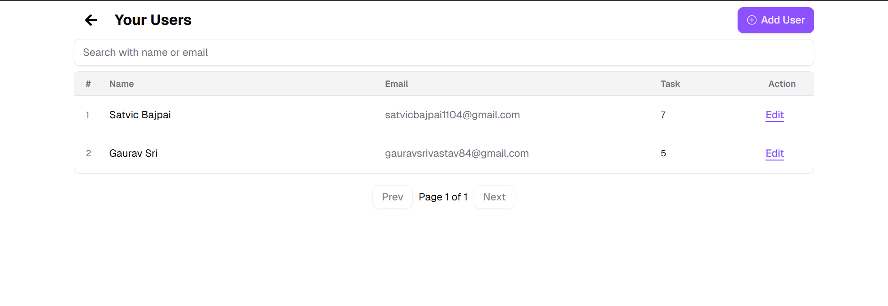

# Panscience Task Management System

A full-stack task management platform built with **Next.js**, **Node.js**, **MongoDB**, and **Cloudinary**. The system supports role-based access for admins and users, allowing task assignment, user management, task filtering, and document uploads.

## 🌐 Live URLs

- 🔗 **Frontend**: [https://panscience.vercel.app](https://panscience.vercel.app)
- 🔗 **Backend**: [https://panscience.onrender.com](https://panscience.onrender.com)

> ⚠️ **Note:** Since this app is hosted on [Render](https://render.com), the backend may take **40–50 seconds** to spin up if it's inactive. Please be patient on first load.

---

## 🛠️ Tech Stack

**Frontend:**

- Next.js
- React Hook Form
- Tailwind CSS
- Cloudinary Upload Widget (via Next.js integration)

**Backend:**

- Node.js
- Express.js
- MongoDB (with Mongoose)
- Cloudinary SDK

---

## 🔗 Quick Navigation

- [Frontend Documentation](#frontend-documentation)
- [Backend Documentation](#backend-documentation)

---

## 🧩 Frontend Documentation

### 🔐 Authentication Flow

- Login page accepts `email`, `password`, and `role` (admin or user)
- On successful login, redirects to `/`
- At `/`, role-based conditional rendering is used to load specific components

> Common Header is used for both roles. However, the **"Add User"** button is only visible to **Admins**.

---

### 🧭 Main Dashboard (`/` route)

#### Header Component

- Shared across admin and user
- Contains:
  - `Add Task` button (visible to both)
  - `Add User` button (admin only)

#### Stats Component

- Visible only to **admin**
- Shows:
  - Total Users
  - Total Tasks
  - Completed Tasks
  - Pending Tasks

#### Recent Users Component

- Admin only
- Displays latest 4 users
- Each card shows:
  - Name
  - Email
  - Assigned Task Count
  - Pending Task Count
  - `See More` → navigates to `/users`

<p align="center">

</p>

#### Recent Tasks Component

- Shared between roles
- Shows latest 4 tasks
- Each task card shows:

  - Title
  - Assigned To → "Ankush, Nidhi +2 more"
  - Status (Pending/Completed)
  - Priority (Low/Medium/High)
  - Due Date
  - `View` button → opens task detail modal

- `View More Tasks` → navigates to `/tasks`

<p align="center">

</p>

---

### 📋 Task Listing Page (`/tasks`)

- Displays tasks in a paginated list (10 per page)
- Filters available:

  - Status
  - Priority

- Role-wise visibility:

  - Admin sees all users' tasks
  - User sees only tasks assigned to or created by them

- `+ New Task` button visible at top (same as header)

<p align="center">

</p>

---

### ➕ Create / Edit Task Page (`/tasks/new` or `/tasks/[id]`)

This route is used for both **creating** and **editing** tasks:

| Route         | Purpose                                                   |
| ------------- | --------------------------------------------------------- |
| `/tasks/new`  | Add a new task                                            |
| `/tasks/[id]` | Edit an existing task (pre-fills the form with task data) |

#### 🧾 Task Form Fields:

- Title
- Description
- Priority
- Due Date
- Document Upload (max 3)
- Assigned To:
  - Admin: Can assign to any user
  - User: Can assign only to self

> 🧠 The form is reused for both create and edit. Based on the route (`[id]` param), the component loads the corresponding task and switches to edit mode.

<p align="center">

</p>

---

### 📂 Cloudinary Upload Integration

- Used `next-cloudinary` uploader widget
- On successful upload:
  - Store public_id, secure_url, original_filename
- Images/documents are shown in the Task Details view

<p align="center">

</p>

---

### 🧑‍🤝‍🧑 Users Page (`/users`)

- Admin only route
- Shows full list of users
- Each card contains:
  - Name
  - Email
  - Assigned Tasks count
  - Pending Tasks count



---

## ▶️ Run Frontend Locally

The frontend is deployed on **Vercel**, but for local development:

### 1. Clone the Repository

```bash
git clone https://github.com/varunvaatsalya/panscience.git
cd frontend
```

### 2. Install Dependencies

```bash
npm install
```

### 3. Create a .env.local File

```js
NEXT_PUBLIC_API_URL=http://localhost:5000
JWT_SECRET=your_jwt_secret
NEXT_PUBLIC_CLOUDINARY_CLOUD_NAME=your_cloud_name
CLOUDINARY_API_KEY=your_cloudinary_api_key
CLOUDINARY_API_SECRET=your_cloudinary_api_secret
NEXT_PUBLIC_CLOUDINARY_UPLOAD_PRESET=your_cloudinary_upload_preset
```

### 4. Run the Development Server

```js
npm run dev
```

Open http://localhost:3000 in your browser.

---

## 🔧 Backend Documentation

The backend is built with **Node.js**, **Express.js**, and **MongoDB**. JWT-based authentication is used, with role-based access control (admin/user), and Cloudinary handles document uploads.

---

### 🗂️ Folder Structure Overview

```
backend/
├── config/
│ ├── db.js
│ └── jwt.js
├── controllers/
│ ├── auth.controller.js
│ ├── user.controller.js
│ └── task.controller.js
├── middlewares/
│ └── auth.js
├── models/
│ ├── user.model.js
│ └── task.model.js
├── routes/
│ ├── auth.routes.js
│ ├── user.routes.js
│ └── task.routes.js
├── utils/
│ └── cloudinary.js
├── .env
└── index.js
```

---

## ▶️ Run Backend Locally

### 1. Clone the Repo

```bash
git clone https://github.com/varunvaatsalya/panscience.git
cd backend
```

### 2. Install Dependencies

```js
npm install
```

### 3. Create a .env File

```js
JWT_SECRET=your_secret
MONGO_URI=mongodb://localhost:27017/panscience
DEFAULT_ADMIN_EMAIL=any_deafault_admin_email
DEFAULT_ADMIN_PASSWORD=any_deafault_admin_password
CLOUDINARY_NAME=your_cloud_name
CLOUDINARY_API_KEY=your_key
CLOUDINARY_API_SECRET=your_secret
```

### 4. Run the Server

```js
npm start
```

By default runs on: `http://localhost:5000`

---

## 🔑 Authentication (`/api/auth`)

| Method | Endpoint    | Description                   | Access    |
| ------ | ----------- | ----------------------------- | --------- |
| POST   | `/register` | Register user (admin or user) | Public    |
| POST   | `/login`    | Login with email/password     | Public    |
| GET    | `/me`       | Get logged-in user info       | Auth only |

🧠 On login, JWT token is issued which contains `id`, `name`, `email`, and `role`.

---

## 👤 User Management (`/api/users`)

| Method | Endpoint | Description       | Access     |
| ------ | -------- | ----------------- | ---------- |
| GET    | `/`      | Get all users     | Admin only |
| GET    | `/:id`   | Get specific user | Auth       |
| POST   | `/`      | Create new user   | Admin only |
| PUT    | `/:id`   | Update user       | Auth       |
| DELETE | `/:id`   | Delete user       | Admin only |

---

## 📋 Task Management (`/api/tasks`)

| Method | Endpoint             | Description                            | Access |
| ------ | -------------------- | -------------------------------------- | ------ |
| GET    | `/`                  | Get all tasks (filtered by role)       | Auth   |
| GET    | `/stats`             | Get task & user stats (admin only)     | Admin  |
| GET    | `/:id`               | Get specific task                      | Auth   |
| POST   | `/`                  | Create a task                          | Auth   |
| PUT    | `/:id`               | Update task                            | Auth   |
| PATCH  | `/:id/complete`      | Mark task as completed                 | Auth   |
| DELETE | `/:id`               | Delete task                            | Auth   |
| DELETE | `/:id/files/:fileId` | Delete a specific file from Cloudinary | Auth   |

🧠 Tasks include:

- `assignedTo` → list of user IDs
- `createdBy` and `createdRole` → to determine role-specific visibility
- `documents` → list of uploaded files (via Cloudinary)

---

## 🧾 Task Schema (`models/task.model.js`)

```js
{
  title: String,
  description: String,
  status: "pending" | "in-progress" | "completed",
  priority: "low" | "medium" | "high",
  dueDate: Date,
  assignedTo: [UserId],
  documents: [
    {
      secure_url,
      public_id,
      original_filename
    }
  ],
  createdRole: "admin" | "user",
  createdBy: UserId,
  timestamps: true
}
```

---

## 🔐 Auth Middleware (`middlewares/auth.js`)

- `authMiddleware`:  
  Verifies JWT token sent via `Authorization` header (as `Bearer <token>`)  
  Sets `req.user` with decoded token payload (id, name, email, role)

- `isAdmin`:  
  Middleware to restrict access — allows only if `req.user.role === 'admin'`

Example usage in routes:

```js
router.use(authMiddleware); // applies to all routes below
router.get("/", isAdmin, handler); // only admin can access
```

---

## ☁️ Cloudinary Integration

- Used for uploading task documents (PDFs/images)
- Frontend uses Next Cloudinary widget to upload
- Uploaded file info is saved in DB

Used to upload documents (images, PDFs) for tasks.

### 📤 Upload Flow:

- Frontend uses Cloudinary widget to upload
- On success, the response includes:
  ```js
  {
    secure_url: "https://res.cloudinary.com/...",
    public_id: "task_uploads/xyz123",
    original_filename: "document.pdf"
  }
  ```
- This data is saved to the task's documents[] array in MongoDB.

---

### 🙌 Made with ❤️ by [Varun Gupta](https://github.com/varunvaatsalya)

Connect on [LinkedIn](https://linkedin.com/in/varunvaatsalya) • Follow on [Instagram](https://instagram.com/varunvaatsalya)
